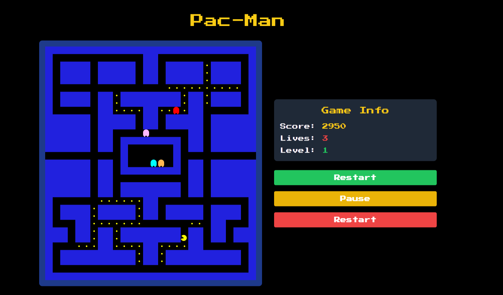

# 🕹️ Pac-Man Revival

<div align="center">
    
    
    
    
</div>

<p align="center">
    
</p>

## 📖 Table of Contents
- [Introduction](#-introduction)
- [Features](#-features)
- [How It Works](#-how-it-works)
- [Code Structure](#-code-structure)
- [Game Mechanics](#-game-mechanics)
- [Setup and Running](#-setup-and-running)
- [Contributing](#-contributing)
- [License](#-license)

## 🎮 Introduction

Welcome to Pac-Man Revival, a modern web-based recreation of the classic arcade game. This project brings the nostalgia of Pac-Man to your browser, complete with ghost AI, power pellets, and all the chomping action you remember!

## 🌟 Features

- 🗺️ Accurate recreation of the original Pac-Man maze
- 👻 Four ghosts with unique AI behaviors
- 💊 Power pellets that turn the tables on the ghosts
- 🎵 Classic Pac-Man sounds (coming soon!)
- 📱 Responsive design for various screen sizes
- 🏆 Score tracking and level progression

## 🔍 How It Works

The game is built using vanilla JavaScript, HTML5, and CSS3. Here's a high-level overview of how the code functions:

1. **Game Initialization**: The game board is created based on a predefined map array.
2. **Game Loop**: A main game loop runs at a fixed interval, updating Pac-Man and ghost positions.
3. **Pac-Man Movement**: Player input is captured to move Pac-Man around the maze.
4. **Ghost AI**: Each ghost has its own AI routine for chasing Pac-Man or scattering to a corner.
5. **Collision Detection**: The game constantly checks for collisions between Pac-Man and ghosts or pellets.
6. **Scoring**: Points are awarded for eating pellets and ghosts (when powered up).
7. **Level Progression**: When all pellets are eaten, the level is reset with increased difficulty.

## 🏗️ Code Structure

The project is structured into three main files:

- `index.html`: The game's HTML structure and UI elements.
- `script.js`: The main game logic and mechanics.
- `map.js`: Contains the maze layout and game constants.

### Key Components in `script.js`

```javascript
// Game state variables
let score, lives, level, pacman, ghosts, powerPelletActive;

// Main game functions
function createGameBoard() { /* ... */ }
function updateGameBoard() { /* ... */ }
function movePacman() { /* ... */ }
function moveGhosts() { /* ... */ }
function checkCollision() { /* ... */ }

// Ghost AI functions
function getGhostDirection(ghost) { /* ... */ }
function updateGhostTargets() { /* ... */ }

// Game control functions
function startGame() { /* ... */ }
function pauseGame() { /* ... */ }
function resetGame() { /* ... */ }
```

## 🎭 Game Mechanics

### Pac-Man Movement
Pac-Man's movement is controlled by the arrow keys. The `movePacman()` function updates Pac-Man's position based on the current direction and checks for wall collisions.

### Ghost AI
Each ghost has a unique behavior:
- **Blinky** (Red): Directly targets Pac-Man's current position.
- **Pinky** (Pink): Aims for a position 4 tiles ahead of Pac-Man.
- **Inky** (Cyan): Uses Blinky's position to set up ambushes.
- **Clyde** (Orange): Alternates between chasing Pac-Man and returning to a "home" corner.

The ghosts switch between "scatter" and "chase" modes at timed intervals, adding depth to their behavior.

### Power Pellets
When Pac-Man eats a power pellet, the ghosts enter a "frightened" mode and can be eaten for bonus points. This is handled by the `activatePowerPellet()` function.

## 🚀 Setup and Running

1. Clone this repository.
2. Open `index.html` in a modern web browser.
3. Click "Start Game" and enjoy!

## 🤝 Contributing

Contributions are welcome! Please feel free to submit a Pull Request.

## 📄 License

This project is open source and available under the [MIT License](LICENSE).

---

<div align="center">
    Made with 💛 by Mohd Mahmodi
</div>